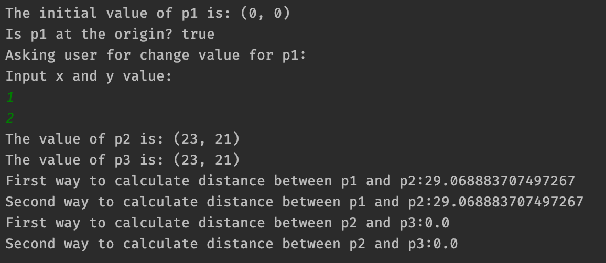
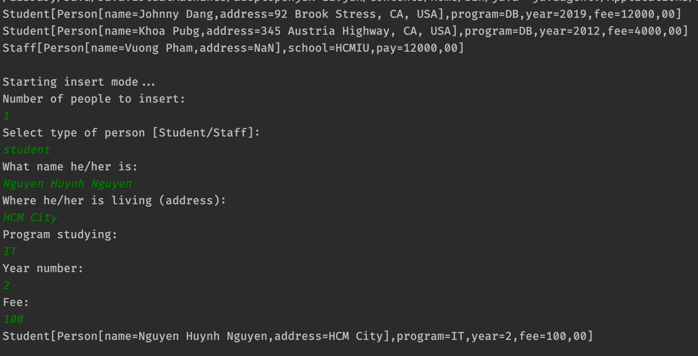
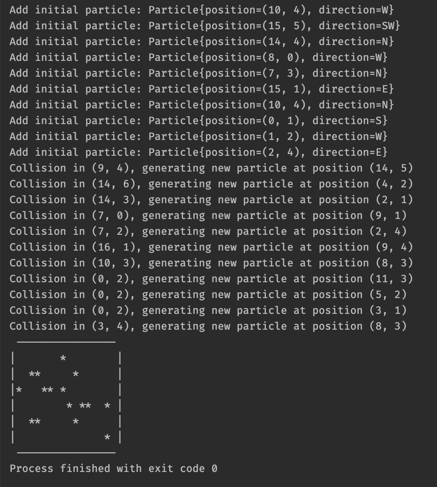

# Object-Oriented Programming Lab No.2 reports
## Requirements
- Java version 11 (or higher)
## Installation and execution
There are no installation needed for this project. But you should open it by using IntelliJ application.
After opened it, check out for each question inside the `./src` directory, it contains the following execution class.
The list of execution classes is
- `src/question01/TestingPoint2D.class`
- `src/question02/TriangleTest.java`
- `src/question03/PersonTest`
- `src/question04/BoxSimulation`
## Screenshots
### Exercise 1

### Exercise 2

### Exercise 3

### Exercise 4
